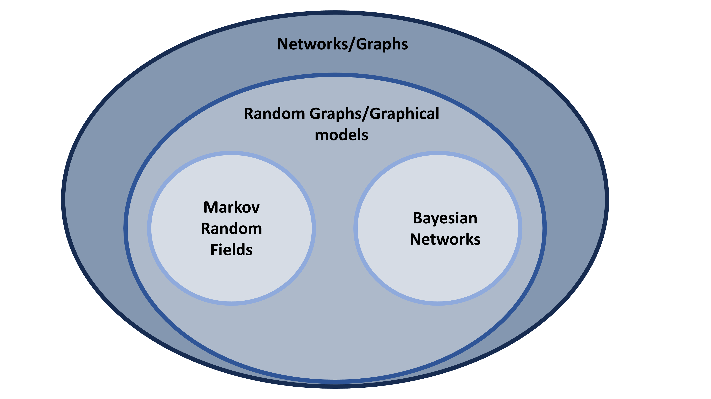

# Introduction

The goal of this blog post is to provide a concise overview of the terminology specific to network psychometrics. While we always strive for clarity, we recognize that several terms, such as networks, graphs, graphical models, and Markov random fields, are often used interchangeably, potentially causing confusion. To address this, we will define these terms and highlight their similarities and differences. In addition, this blog post serves as a valuable resource for researchers who want to effectively incorporate these methods when communicating their findings in writing or presentations.

## Networks/Graphs

A network or a graph are the most general terms we use to refer to a structure of interconnected elements. They consist of nodes and edges that connect the nodes. In different contexts, they can represent a complex system in which individual components interact with each other. Depending on the domain, nodes and edges (also called vertices and links, respectively) can have different meanings. For example, in computer science, a network/graph often refers to a collection of devices (such as computers, servers, or other hardware) that are linked together to share resources and information. In some social sciences, a node refers to an individual and an edge refers to a friendship or cooperation between individuals; in these cases, the nodes represent fixed entities. In psychology, and particularly in network psychometrics, nodes often refer to psychometric variables, such as symptoms of a disorder or item responses on an educational test, and edges refer to a statistical association between these symptoms/educational measures. As noted above, networks or graphs are the most general terms and are often used as an umbrella term for the others. They are most often used in the introductory sections of methodological papers on network psychometrics, but may also be used as a general term in some less technical papers aimed at applied researchers, such as tutorial papers.

## Random Graphs/Graphical Models

Random graphs, or graphical models, can be used to represent a wide range of relationships and structures, from social networks to transportation systems. Graphs can be directed (edges have a specific direction) or undirected (edges have no direction). A graphical model/random graph uses a graph/network to represent probabilistic dependencies between random variables. It adds a probabilistic interpretation to the graph, allowing us to perform probabilistic reasoning and inference. In a graphical model, nodes typically represent random variables, and edges represent probabilistic dependencies between them. Network psychometrics is primarily concerned with graphical models. These terms are used in methodological papers to explain the statistical background of the models. However, the term graphical model is sometimes used as a synonym for networks, and thus may also serve as a general term.

## Markov Random Fields

A Markov Random Field (MRF) is a special type of graphical model used to represent the probabilistic relationships of undirected graphs. It is a probabilistic graphical model in which the conditional independence structure of the random variables is represented by a graph. The "Markov" aspect refers to the property that the probability distribution of a variable depends only on its neighbors (variables connected by edges), given the values of all other variables. These models are used in network psychometrics to reveal the conditional independence structure of the variables under study. For example, researchers can look at two sets of symptoms for two different mental disorders, see which symptoms are conditionally independent given the rest of the symptoms in the network, and highlight the most central symptoms. Almost all models studied in network psychometrics, such as Ising models for binary data, ordinal models, or Gaussian graphical models, are Markov random field models.

## Bayesian Network Psychometrics vs. Bayesian Networks

There are also other types of graphical models, such as Bayesian networks, which use directed and acyclic graphs (DAGs) to represent the conditional dependencies between nodes. We should note here that Bayesian analysis of psychometric network models, which is a methodology mostly focused on analyzing MRF graphical models, is distinct from Bayesian networks, which are a class of random graph models.

# Summary

In summary, a network or graph is a general concept and mathematical structure for representing relationships, a graphical model or random graph uses a graph to represent probabilistic dependencies, and a Markov random field is a specific type of graphical model with certain probabilistic properties (see Figure #figure). Unless otherwise noted, these terms are used interchangeably in less technical papers.

