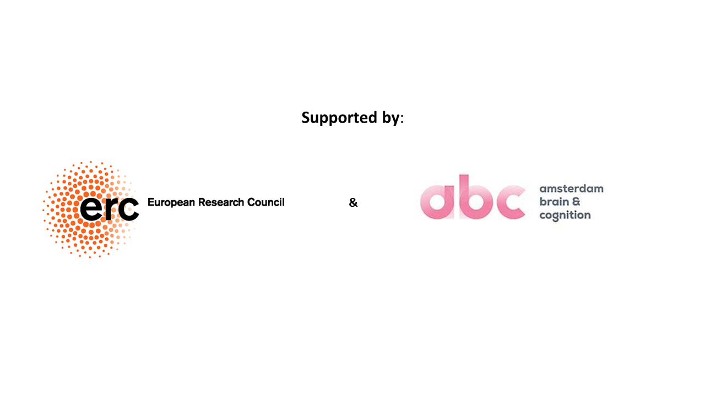

---
# A Demo section created with the Blank widget.
# Any elements can be added in the body: https://wowchemy.com/docs/writing-markdown-latex/
# Add more sections by duplicating this file and customizing to your requirements.

widget: hero # See https://wowchemy.com/docs/page-builder/
headless: true # This file represents a page section.
weight: 10 # Order that this section will appear.
title: |
  
 Bayesian Analysis of Psychological Networks

hero_media: logo.png
design:
  # Choose how many columns the section has. Valid values: 1 or 2.
  columns: '1'
  # Add custom styles
  css_style:
  css_class:
---

The Bayesian Graphical Modeling Lab develops Bayesian methodology for the analysis of graphical models. In psychology, graphical models or networks are used to characterize dynamical systems of interacting psychological variables. Since the structure of the network is usually unknown, we must infer it from empirical data. There are many structures that could underlie a network of interest, and we are usually uncertain that we have found the one true model with the data we have. The Bayesian approach provides a principled way to deal with this uncertainty by expressing the plausibility of different network structures for the data at hand, determining the statistical evidence for edge inclusion and exclusion, and providing robust prediction intervals for the network parameters. These are just a few of the concrete benefits of the Bayesian approach that allows us to analyze graphical models with confidence. The Bayesian Graphical Modeling Lab is dedicated to making these advantages available to end users through open access publications, open source statistical software in the form of R packages, and by incorporating them into the free, easy-to-use JASP program.

 

